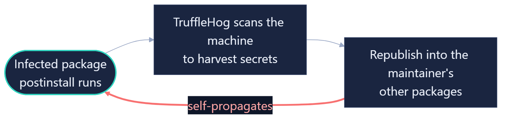

<!-- ============================================================
     FINAL PRESENTATION DECK — SKELETON (structure only)
     Source of truth: presentation-spec.md (8-beat gap-as-setup arc).
     Backbone = the report's three-claim evaluation arc.
     ≤15 min hard cap; ~14.9 planned. Beat budgets in each slide's SCRIPT tag.
     This file is STUBS ONLY — no narrative content or design decisions yet;
     the content tickets (#165–#169) fill each movement.
     Keep every slide's UPPER-RIGHT corner clear for the talking-head overlay.
     ============================================================ -->

<!-- _class: title -->
<!-- _paginate: false -->
<!-- _footer: "" -->

# Multi-Party Authorization Proxy

### Final Presentation — CS 6727 Practicum

Ian Barish

AI use: deck drafted &amp; copy-edited with Claude; research, design, and all project decisions are my own.

<!-- SCRIPT (~10s): title card. Not one of the 8 beats — holds while the
     talking-head intro lands, then straight into the hook. -->

---

<!-- _class: statement -->

## Multi-party authorization is an **underused** security control

What is it?Requiring more than one person to sign off before an action goes through.

Where you already see it — always boxed into one product

AWSbackup vaults · key imports

Google Cloudprivileged IAM grants

Azurebackups · device configs

Crypto multisigmoving funds

<b>My project:</b> a general-use multi-party authorization proxy <b>My headline use case:</b> package publishing

<!-- SCRIPT (~35s | Opening pre-hook → transition into the hook):
     I'm Ian Barish. Multi-party authorization — requiring more than one person
     to approve something before it goes through — is an underused security
     control. And it's not that nobody does it. A crypto multisig wallet needs
     several keys to move funds; every major cloud has reached for it — AWS,
     Google, Azure all gate a few of their most sensitive operations behind
     multiple approvers. But look closely and each one is boxed into a single
     product — none is offered as a general capability you can put in front of
     anything. So I built a proxy that does exactly that, and I'll make the case
     today that it belongs in more than one place. My headline use case is
     package publishing — because it's where one stolen credential does the most
     damage. And last September, we watched exactly that happen.
     [transition #2: hands straight into the incident — cut to the date slide] -->

<!-- GROUNDING: the conviction is the bookend's front post (paid off in Beat 7/
     Close). The examples band discharges the "underused" half of the thesis the
     honest way — breadth-with-siloing, not a false "nobody does this" (report §4
     Move 3, Final Report/research/sources/primitive-multiparty-approval.md):
     • AWS "multi-party approval — backup vaults, key imports": AWS Organizations
       MPA, gating AWS Backup air-gapped vaults + Payment Cryptography root-key
       imports (bib aws-mpa, aws-backup-mpa). "no single individual can
       unilaterally establish the root of trust" is AWS's own words for the
       proxy's value prop.
     • Google Cloud "Privileged Access Manager — IAM grants": multi-level,
       multi-approver gating of temporary IAM role grants (bib google-cloud-pam).
     • Azure "multi-user approval — backups, device configs": Backup MUA (Resource
       Guard) + Intune Multi-Admin Approval (bib azure-backup-mua, intune-maa).
       Azure's GENERAL PAM product (PIM) is the sharpest underused datapoint —
       first approver resolves, no quorum — but that nuance is held for the report,
       not the opening slide.
     • Crypto "multisig wallets — moving funds": m-of-n in production (BIP 11,
       bib bip11-multisig / primitive-crypto-choices.md) — kept as the audience-
       recognizable anchor, not part of the §4 human-approval-adoption evidence.
     The pattern line = the note's synthesis: all three giants reached for it,
     not one offers it as a general cross-platform capability; each is fused to
     the platform that ships it. That siloed adoption IS "underused." Does NOT
     reveal m-of-n as the answer to the worm; that's the Thesis (Beat 3). -->

---

## Case Study

<strong>September 14, 2025 -</strong> An npm supply-chain worm begins.

1

stolen publish credential — all it needed to start

~500

packages compromised in roughly a day

2M+

weekly downloads on a single infected package

How it spreads — after the token is stolen

<!-- SCRIPT (~1.0 min | Hook 1 — the incident):
     On September 14th, 2025, an npm maintainer unknowingly ships a new version
     of their package with malware buried inside — and it spends the next day
     tearing through the npm registry. Here's how it moves: when that infected
     package lands on another developer's machine, it steals the tokens that
     developer uses to publish their own packages, and quietly republishes
     itself into every one of them. Each new victim becomes a carrier. In about
     a day, a single infection became roughly 500 compromised packages —
     including one downloaded more than two million times a week.
     [leaves the audience at "and then it was over, right?" → the recurrence
     turn, Beat 1b] -->

<!-- GROUNDING: incident real + dated; self-propagation engine (stolen publish
     token → republish, no human); "one credential" as the load-bearing unit
     (seeds the thesis); blast radius. Menace only — no diagnosis of why fixes
     failed (that's the Gap). Package name kept vague; "Shai-Hulud" is revealed
     at Beat 1b. Source: incident-shai-hulud.md. -->

---

## They named it Shai-Hulud

The sandworm from <em>Dune</em> — bury one defense, and it surfaces somewhere else.

Sep 2025

Patient Zero · ~500 packages

Nov 2025

"Second Coming" · ~700 packages · 25k+ repos

Spring 2026

TanStack · valid SLSA L3

Jun 2026

Red Hat packages

Jul 2026

AsyncAPI · bypassed all review

<em>Dune: Part Two</em> © Warner Bros. Pictures

What npm rebuilt in response
<ul class="rlist">
<li>Mandatory 2FA on local publishing</li>
<li>Granular tokens, 7-day lifespans</li>
<li>Trusted Publishing — no long-lived tokens</li>
<li>FIDO hardware keys replacing TOTP</li>
</ul>

Every fix hardened <em>who publishes</em> — and it kept surfacing.

<!-- SCRIPT (~0.8 min | Hook 2 — recurrence + the response that got walked around):
     The ecosystem scrambled. npm and GitHub rebuilt how publishing works —
     mandatory 2FA, seven-day tokens, Trusted Publishing, hardware keys. Serious
     changes. And two months later it came back, bigger — twenty-five thousand
     repositories in a single weekend. And again. And again — the most recent
     wave just weeks ago. They named it Shai-Hulud, after the sandworms in Dune,
     because every time we bury a defense, it surfaces somewhere else. And look
     at what all of those fixes have in common: every one of them is about *who*
     is allowed to publish. That's the pattern — and it isn't unique to npm.
     [on the Dune line the sandworm surfaces; "who is allowed to publish" is the
     bridge into the wider matrix, Beat 2] -->

<!-- GROUNDING: name reveal + Dune recurrence metaphor + Shai-Hulud's CLOSER —
     the auth-layer controls actually deployed against it, which the recurrence
     timeline shows getting walked around. Still menace, not diagnosis: plants
     "every fix was about WHO publishes" as the bridge into Beat 2's wider board;
     the axis payoff (none checks whether the release SHOULD ship) is held for
     Beat 2/3. All facts from incident-shai-hulud.md (Final Report/research):

     ON-SCREEN — npm's response list (the .response block): "mandatory 2FA on
     local publishing · granular tokens, 7-day lifespans · Trusted Publishing,
     no long-lived tokens · FIDO keys replacing TOTP" — verbatim from GitHub
     Blog, "Our plan for a more secure npm supply chain" (2025-09-23), quoted in
     incident doc L91-97. The closer "every fix hardened WHO publishes" is that
     doc's §4 hinge (L99-100): every measure strengthens who authenticates / how
     the token is scoped — auth + integrity layers — none asks whether this
     artifact should ship. Recurrence-walked-around framing: incident doc L103.

     ON-SCREEN NUMBERS (timeline nodes; verified, incident-shai-hulud.md §"Recurrence"):
     • Nov node "~700 packages · 25k+ repos" + spoken "25,000 repositories in a
       single weekend" — the Shai-Hulud 2.0 / "Second Coming" wave (~Nov 21-24
       2025, ~1,000 new repos every 30 min; 25,000+ repos across ~500 GitHub
       users). Source: WIZ, "Sha1-Hulud 2.0 — Ongoing Supply Chain Attack" (bib:
       shai-hulud-2-wiz). incident doc L104-108.
     • Sep 2025 node "~500 packages" (Patient Zero) — GitHub Blog / CISA
       (shai-hulud-github, shai-hulud-cisa). incident doc L58-68.
     • Spring 2026 node "TanStack · valid SLSA L3" — 84 artifacts / 42 @tanstack/*
       pkgs, first validly-attested SLSA-L3 malware. Source: SNYK, "TanStack npm
       Packages Hit by Mini Shai-Hulud" (shai-hulud-tanstack-snyk). incident doc L110-117.
     • Jun 2026 node "Red Hat packages" — 32 @redhat-cloud-services pkgs (~80K wk).
       Jul 2026 node "AsyncAPI · bypassed all review" — 5 @asyncapi pkgs, pushed
       to unprotected branches, no human review. Source: UNIT 42, "The npm Threat
       Landscape" (updated 2026-07-15; shai-hulud-landscape-unit42). incident doc L125-133.

     NOTE: GIF only animates from HTML/PPTX, not PDF; present from HTML when
     recording. -->

---

## Not just npm. Not just one worm

Every control the industry built to stop a poisoned release, against every way a release gets poisoned.

<table class="matrix">
<thead>
<tr>
<th class="ctrl">Control<small>and the decision it actually gates</small></th>
<th>Stolen credential<small>Shai-Hulud</small></th>
<th>Trusted insider<small>XZ backdoor</small></th>
<th>Compromised CI<small>poisoned pipeline</small></th>
<th>Direct publish<small>skip repo + CI</small></th>
</tr>
</thead>
<tbody>
<tr><td class="ctrl">Mandatory 2FA / MFA<small>proves login identity</small></td><td>~</td><td>✗</td><td>✗</td><td>✗</td></tr>
<tr><td class="ctrl">Trusted Publishing (OIDC)<small>proves publish identity</small></td><td>✓</td><td>✗</td><td>✗</td><td>~</td></tr>
<tr><td class="ctrl">Build provenance (SLSA)<small>attests build integrity</small></td><td>✗</td><td>✗</td><td>✗</td><td>✗</td></tr>
<tr><td class="ctrl">Required reviews + branch protection<small>gates the repo merge</small></td><td>✓</td><td>~</td><td>✗</td><td>✗</td></tr>
<tr><td class="ctrl">CI/CD deployment gates<small>gates the pipeline deploy</small></td><td>✓</td><td>~</td><td>~</td><td>✗</td></tr>
<tr><td class="ctrl">Artifact-repo promotion<small>gates internal promotion</small></td><td>✓</td><td>~</td><td>~</td><td>✗</td></tr>
</tbody>
</table>

✓ covers it &nbsp;·&nbsp; ~ partial &nbsp;·&nbsp; ✗ misses it

<!-- SCRIPT (~1.75 min | Claim 1 — widen to the board, land the axis):
     And it isn't just npm. The same kinds of controls have been rolled out
     across the software industry to stop a poisoned release — not just
     authentication, but build provenance, mandatory code review, deployment
     gates, artifact promotion. Here they are against every way a release
     actually gets poisoned: a stolen credential — that's Shai-Hulud — a trusted
     insider slipping in a backdoor, a compromised build pipeline, or a publish
     that skips the repo and the pipeline entirely. Walk the rows: Trusted
     Publishing shuts down a stolen static token, but nothing else. Provenance
     attests the build — but a poisoned pipeline produces a perfectly valid
     attestation; in the TanStack wave, malware shipped with signed SLSA Level 3
     provenance, the first case of its kind. Review gates and deploy gates each
     catch a slice and miss the rest. Now look down the board: not one of these
     controls completely covers more than one or two columns. And they all miss
     for the same reason — every one asks *are you who you say you are* and *is
     this artifact intact*. Not one asks the question that actually decides a
     supply-chain attack: should this release be going out at all?
     [hands to the Thesis, Beat 3 — the answer] -->

<!-- GROUNDING: this IS report Table I, competitor rows only (proxy row is
     added at Beat 3 — the reveal). Verdicts + row order + "decision it gates"
     axis subtitles are the SETTLED verdicts from the controls-matrix research
     (Final Report/research/controls-matrix/README.md, Artifact map §"seven
     rows"); each cell is source-defended in that row's ctrl-*.md note.
     FRAMING (deliberate departure from script-beats' Gap draft, and from the
     first cut of this slide): the draft said every control fails the SAME
     (compromised-maintainer) column; Table I shows the Stolen-credential column
     is mostly GREEN (Trusted Publishing / 2FA handle a stolen static token). A
     viewer reads a green "Stolen credential" cell as "this stopped Shai-Hulud"
     and stalls — it fights the hook. RESOLUTION: land Shai-Hulud on slide 4
     (its ACTUAL deployed controls + the timeline showing it evolved past them),
     so THIS slide is no longer about Shai-Hulud — it WIDENS to the whole
     industry's controls vs every release-poisoning attack class. Green now
     reads as "covers this attack class," not "stopped the worm," and the
     legible takeaway is: no row completely covers more than one or two columns;
     the proxy (added at Beat 3) is the only full row. Faithful 4-column Table I
     kept (proxy row survives for Beat 3's reveal). Four scenarios named per README: Stolen
     credential (Shai-Hulud) · Trusted insider (XZ, CVE-2024-3094) · Compromised
     CI (authentically-built poisoned artifact) · Direct publish (bypass repo +
     CI). SLSA-L3 claim anchored to the Spring-2026 TanStack / Mini-Shai-Hulud
     wave (Snyk, shai-hulud-tanstack-snyk) — NOT the Sep original; "a later
     wave" keeps that honest. No proxy row here; it swaps in at Beat 3. -->

---

## The missing layer: authorization

<table class="matrix">
<thead>
<tr>
<th class="ctrl">Control<small>and the decision it actually gates</small></th>
<th>Stolen credential<small>Shai-Hulud</small></th>
<th>Trusted insider<small>XZ backdoor</small></th>
<th>Compromised CI<small>poisoned pipeline</small></th>
<th>Direct publish<small>skip repo + CI</small></th>
</tr>
</thead>
<tbody>
<tr><td class="ctrl">Mandatory 2FA / MFA<small>proves login identity</small></td><td>~</td><td>✗</td><td>✗</td><td>✗</td></tr>
<tr><td class="ctrl">Trusted Publishing (OIDC)<small>proves publish identity</small></td><td>✓</td><td>✗</td><td>✗</td><td>~</td></tr>
<tr><td class="ctrl">Build provenance (SLSA)<small>attests build integrity</small></td><td>✗</td><td>✗</td><td>✗</td><td>✗</td></tr>
<tr><td class="ctrl">Required reviews + branch protection<small>gates the repo merge</small></td><td>✓</td><td>~</td><td>✗</td><td>✗</td></tr>
<tr><td class="ctrl">CI/CD deployment gates<small>gates the pipeline deploy</small></td><td>✓</td><td>~</td><td>~</td><td>✗</td></tr>
<tr><td class="ctrl">Artifact-repo promotion<small>gates internal promotion</small></td><td>✓</td><td>~</td><td>~</td><td>✗</td></tr>
<tr class="proxy"><td class="ctrl">The proxy<small>authorizes the release itself</small></td><td>✓</td><td>✓</td><td>✓</td><td>✓*</td></tr>
</tbody>
</table>

✓ covers it &nbsp;·&nbsp; ~ partial &nbsp;·&nbsp; ✗ misses it &nbsp;&nbsp;&nbsp;·&nbsp; ✓* under one deployment precondition, revisited later

<!-- SCRIPT (~0.9 min | Claim 1 — name the missing layer, land m-of-n):
     So who should be answering that question? The owners — obviously. The
     problem is that nothing ever gave them a way to. Every control we just saw
     lives at one layer: proving identity, proving the artifact is intact. What's
     missing is a layer *above* them — authorization. Not *are you who you say
     you are*, but *did the people responsible for this package actually decide
     to ship it?* That's the layer I built: a proxy that holds a release until
     more than one owner signs off. Drop that row into the board, and it's the
     only one that covers every column — because a stolen credential is still
     just one owner, and one owner is no longer enough. It's the same reason it's
     the only row that also stops a trusted insider: the XZ backdoor was a single
     maintainer, and m-of-n makes one signature not enough.
     [the proxy row drops in / lights up; hands to Beat 4 — HOW it holds the
     release] -->

<!-- GROUNDING: the payoff row is report Table I row 7 (ctrl-the-proxy.md) —
     verdicts ✓·✓·✓·✓* (Stolen·Insider·CI·Direct), the ONLY all-covered row.
     THESIS = authorization as a named layer distinct from authn/integrity (the
     axis set up on slide 5); m-of-n human authorization is the instance that
     fills it. Subtitle "authorizes the release itself" is the differentiator —
     read down the "decision it gates" column: login identity / publish identity
     / build integrity / repo merge / pipeline deploy / internal promotion / the
     release itself. Payoff: a stolen credential is ONE owner, m-of-n makes one
     insufficient (callback to Hook 1's "one credential"). ✓* on Direct publish
     carries the sole-credential precondition (PUB-2, controls-matrix README
     Caveat 1) — shown honestly, deferred to Beat 7 limitations, not hidden.
     XZ (CVE-2024-3094) named once as proof the insider case is a real pattern,
     not hypothetical — it's the Trusted-insider column the proxy row now covers.
     Advocacy ("belongs everywhere") is planted lightly here, paid off Beat 7/Close.
     Mechanism (hash-bind, per-vote reauth, Ed25519, quorum) is HELD for Beat 4:
     here we name WHAT the layer is, not HOW it works. -->

---

## How the proxy authorizes a release

It sits in front of the registry: an upload is <em style="color:#e8edf7;font-style:normal">held, not published</em>, until the package's owners authorize the exact artifact.

1<h4>Request</h4>
Published via <em>twine</em> — to the proxy, not the registry.

2<h4>Hash-bind</h4>
Artifact <em>hashed</em> and held; the approval is <em>bound</em> to it.

3<h4>Approve</h4>
Each owner <em>re-auths</em> and <em>signs</em> their vote.

4<h4>Quorum</h4>
Waits for <em>m-of-n</em>. One denial stops it.

5<h4>Publish</h4>
Hash <em>re-checked</em>, then released to PyPI.

The owners approve <strong>one exact artifact</strong> — and that's the artifact that ships.

<!-- SCRIPT (~1.5 min | Claim 2 setup — teach the flow so the demo is evidence, not instruction):
     Here's how it actually works. The proxy sits in front of the registry — PyPI,
     in my case — as a gate. Nothing reaches the registry without passing through
     it. [1 — Request] A maintainer publishes exactly the way they already do:
     twine upload. The proxy authenticates the token and validates the package —
     but instead of forwarding it to PyPI, it stops. [2 — Hash-bind] It computes a
     SHA-256 hash of the uploaded artifact, holds the artifact, and opens an
     approval request bound to that exact hash. From this moment the thing under
     review is one specific set of bytes. [3 — Approve] Each owner is notified. To
     vote, they re-authenticate — password and 2FA, every time — and their approval
     is recorded as an Ed25519-signed vote on that hash. Not a click the proxy
     could fake: a signature that verifies on its own. [4 — Quorum] The release
     waits. It publishes only when m-of-n owners have approved, and any single
     denial kills it. One stolen credential gets you one vote, and one vote is no
     longer enough. [5 — Publish] When quorum is reached, the executor does one
     last thing before it ships: it re-hashes the held artifact and checks it still
     matches what the owners approved — so the release that goes out is byte-for-byte
     the one they signed off on. Only then does it publish, and then it destroys the
     held copy. That's the whole mechanism: one upload, held; m owners signing off
     on one exact artifact; and only then a publish. You're about to watch it run —
     once where it should ship, and once where it shouldn't.
     [hands straight to the demo, Beat 5] -->

<!-- GROUNDING: the five stages ARE the one-time publish flow — docs/use-cases/
     01-package-publishing.md sequence diagram (L30-56) and its Security Properties
     (L76-82). Per-stage sourcing:
     • Request/authenticate/validate + "held, not published": that doc L38-42;
       proxy = the HTTP surface / forward gate (docs/architecture.md L59, L86-93).
     • Hash-bind: L41 "compute SHA-256, create Approval Request bound to hash".
     • Approve = per-vote re-auth + Ed25519-signed Vote: L44 ("re-auth and signed
       Vote"), architecture.md Audit box L64 (each Vote Ed25519-signed, offline-
       verifiable); approver-authentication.md / cryptography.md own the details.
     • Quorum + single-denial: L45 ("effective votes drive quorum and the single-
       denial rule"), L46; quorum >= 2 config L69.
     • Publish = executor re-verifies SHA-256(held)==action_hash, refuses on
       mismatch, then destroys artifact: L49-52; architecture.md Executor L62
       (synchronous in MVP) + Artifact-holding L61 (destroyed on every terminal).
     • flow-note "the owners approve one exact artifact — and that's what ships":
       hash binding, package-publishing.md L78 (approvers approve that specific
       hash; executor re-verifies before publish). DELIBERATELY NARROWED from an
       earlier "even if the proxy is compromised" draft: a fully compromised proxy
       holds the PyPI token and can publish directly, so hash-binding does NOT
       prevent that. What survives proxy compromise is DETECTION — forged approvals
       fail Ed25519 verification in the signed audit trail (architecture.md L64;
       package-publishing.md L90) — which is a threat-delta/discussion point, not a
       mechanism-slide claim. The slide claims only the true, narrow property: the
       approved artifact is the one that ships (no swap under normal operation).

     ARTIFACT DECISION (US10/US33): spec says reuse report Fig 1 (architecture
     figure). Fig 1 is only a PLANNED figure in the report outline (Final Report/
     outline.md L144) — not yet rendered — and the source diagram is a 6-participant
     sequence diagram, too dense for a talking-head slide. Chose the theme's
     purpose-built .flow numbered-step strip instead: same five stages, same
     security properties, same terms as report §5, at slide legibility. Consistency
     (US33) holds at the level that matters; when Fig 1 is rendered for the report
     it should show this same flow. Mechanism kept to WHAT each stage does; the
     demo (Beat 5) shows it come true. -->

---

<!-- _class: demo -->

## Beat 5 · Demo  ▶ [ SCREEN RECORDING ]

<!-- ============================================================
     RECORDING PLACEHOLDER — ~5 min screen-recorded marimo cut spliced in post.
     NOT a live slide. Act 0 single-button reveal (3 co-owners provisioned,
     keys encrypted at rest, TOTP secret NOT shown) → Act 1 legit → reaches
     quorum → publish → pip install ==1.0.0 succeeds → Act 2 malicious →
     freeze at 2/3 → morning catch → out-of-band verify → deny → pip install
     ==1.0.1 fails. Act 1 (mechanism pace) ≈ Act 2 (divergence pace).
     Demo rework is #163 (Work Product A); this slide is just its anchor.
     Real processing waits sped up in post; the presentation is never sped up.
     ============================================================ -->

<!-- SCRIPT (~5.0 min | Claim 2 evidence):
     • placeholder — the recorded demo carries this beat. -->

---

## Aren't we adding new risks?

<em style="color:#e8edf7;font-style:normal">Yes.</em> One gate in front of every release concentrates risk — the biggest new threat the project has. So here's the <em style="color:#e8edf7;font-style:normal">whole</em> surface it introduces: all 33 threats, catalogued.

<h5>Concentration of risk</h5>

CODE-1CODE-2CRYPTO-1HOST-1HOST-2HOST-3HOST-4IDENT-1IDENT-6

<h5>Human factor</h5>

VOTE-1VOTE-2VOTE-3VOTE-4VOTE-5IDENT-2IDENT-4

<h5>Availability</h5>

DOS-1DOS-2DOS-3DOS-4IDENT-5

<h5>Also introduced</h5>

INFO-1PUB-1PUB-2

<h5>Improved by the proxy — threats it makes better</h5>

CORE-1CORE-2CORE-3CORE-4HOST-5

<h5>Inherited — the registry's surface, out of scope</h5>

CRYPTO-2CRYPTO-3IDENT-3PUB-3

<i class="i-conc"></i> Concentration — the gate is one target
<i class="i-human"></i> Human factor — fatigue · coercion · replay
<i class="i-avail"></i> Availability — the gate as a jam point
<i class="i-other"></i> Other — outside the three themes
<i class="i-improved"></i> Improved — threats the proxy makes better
<i class="i-inherited"></i> Inherited — out of scope, the registry's

<!-- SCRIPT (~2.0 min | Claim 3 — concede, bound to three themes, plant the cure):
     Let me ask the question you're already asking: doesn't this add new risk? Yes —
     it does. So I did the whole accounting: every threat the proxy introduces,
     improves, or inherits — thirty-three of them, on the screen. Not to be read
     line by line, but so you can see I didn't cherry-pick, and that the ones worth
     your attention cluster into three themes. [1 — Concentration] The first, and
     the biggest: concentration. I took the risk that used to be spread across every
     maintainer's laptop and put it behind one gate — so did I just build one really
     juicy target? Compromise the proxy's host, its database, or its admin account,
     and you're past it. I'm not going to wave that away. [2 — Human factor] The
     second is the human factor. The whole
     design leans on people approving — so it inherits how people fail: approval
     fatigue, a coerced click, a replayed credential. It's only as strong as the
     humans operating it. [3 — Availability] The third is availability. I turned
     publishing into a gate, and a gate is something you can jam — flood it, or have
     one approver sit on every request and simply never vote. Everything else it
     introduces — a couple of disclosure and bypass edges — is catalogued too, just
     not the headline. And quietly: the proxy also improves five threats it doesn't
     create, and inherits four that were always the registry's to own, not mine.
     Here's the important part — the worst of these, concentration, isn't permanent.
     It exists because the proxy is a bolt-on in front of a registry it doesn't
     control. Build this into the registry itself, and the juicy target you're
     worried about is the registry, which is already the juicy target. I'll come
     back to that.
     [hands to discussion, Beat 7] -->

<!-- GROUNDING: this IS the full threat catalog (docs/threat-model/, 33 threats),
     pulled via `tools/threat_model.py query --only id,title,delta,bucket,stride`.
     Delta tallies verified against the tool: 24 introduced · 5 improved · 4
     inherited = 33 (US20 completeness). Every chip is a real threat ID; the wall
     shows the WHOLE model so completeness is shown, not asserted.

     Three-theme grouping over the INTRODUCED subset (US19; talk-level lens, NOT a
     re-bucketing of the catalog — the report keeps delta×bucket):
     • Concentration (attack the single box): CODE-1, CODE-2, CRYPTO-1, HOST-1,
       HOST-2, HOST-3, HOST-4, IDENT-1, IDENT-6. Biggest column by design —
       reinforces the US18 concession that concentration is the worst residual.
     • Human factor (the mechanism leans on people): VOTE-1..5, IDENT-2, IDENT-4.
       fatigue=VOTE-4, coercion=VOTE-3, replay=VOTE-2 are the named exemplars (US19).
     • Availability (the gate as a jam point): DOS-1..4, IDENT-5.
     • Remainder, introduced-but-outside-the-three (US19/US20 — "disclosure,
       payload substitution ... visible but not dwelt on"): INFO-1 (disclosure),
       PUB-1 (payload substitution), PUB-2 (proxy bypass). RED "other" chip — a
       real fourth group, visible but not narrated as a theme.
     Improved (CORE-1..4, HOST-5) and Inherited (CRYPTO-2, CRYPTO-3, IDENT-3,
     PUB-3) sit in the muted bands below, but are now COLOUR-CODED too — green
     "improved" (the proxy's wins) and purple "inherited" (out of scope, the
     registry's surface). COLOUR PALETTE (all four delta groups distinct):
     teal/indigo/amber = the three narrated themes · red = other introduced ·
     green = improved · purple = inherited. This departs from US20's "quiet /
     shown-not-narrated" register for improved+inherited: they are still spatially
     quieter (dimmer muted-band background, below the fold of the three themes) but
     colour-coded so the whole delta is legible at a glance. Still not narrated as
     themes; the three themes remain the spoken headline.

     Native-registry = the structural cure for concentration (US21), planted in the
     SCRIPT only (no on-slide cure line — kept off the slide for concision), paid
     off in Beat 7 future work (US27); Trusted Publishing is the precedent. The
     "one juicy target" objection (US17) is voiced in the script under the
     concentration theme, not the heading — the plain on-slide question is
     "Aren't we adding new risks?" with the honest one-word answer, "Yes."
     Three themes are the HEADLINE not an exhaustive partition (US19) — the "cluster
     into three themes" line never claims the delta *is* three themes.
     Divides labor with Beat 7 (US24): here = new surface I own; Beat 7 = operator
     duties + scope boundaries + future work. -->

---

## It only works if it's deployed right

The proxy's guarantees rest on a few steps it <em style="color:#e8edf7;font-style:normal">can't enforce for you</em>. Two carry the most weight.

<ul class="checklist">
<li class="hi"><b>Revoke every pre-existing publish token.</b> The whole guarantee rests on the proxy holding the <em>only</em> credential that can upload — leave an old one live and an attacker skips the gate entirely.<small>PUB-2 · proxy bypass</small></li>
<li class="hi"><b>Choose the quorum and the co-owners deliberately.</b> High enough to mean something, low enough that losing one approver can't freeze a release — and choose co-owners that are unlikely to collude.<small>DOS-3 · DOS-4 · CORE-3</small></li>
<li class="dim">~two dozen more — the full operator checklist ships with the proxy</li>
</ul>

<!-- SCRIPT (~0.75 min | Discussion 1 — deployment prerequisites):
     Everything I've shown assumes the proxy is deployed correctly, and a few of
     those steps are the operator's job — the proxy can't enforce them for you.
     Two matter most. First: revoke every publish token that existed before the
     proxy. The entire guarantee rests on the proxy holding the only credential
     that can upload to the registry. Leave an old maintainer token live and an
     attacker doesn't have to beat the quorum — they just publish around it.
     Second: choose your quorum and your co-owners deliberately. Set the threshold
     high enough to mean something, but low enough that losing one approver to a
     vacation doesn't freeze every release, and pick owners who aren't going to
     collude. Everything else — HTTPS, an append-only audit mirror, out-of-band
     enrollment — is in the operator checklist that ships with the proxy.
     [hands to limitations — what I'm NOT claiming] -->

<!-- GROUNDING: the two highlighted items are the US22 emphasis, drawn verbatim
     from docs/threat-model/operator-checklist.md:
     • "Revoke all pre-existing project API tokens ... so the sole upload
       credential lives in the proxy (PUB-2)" — checklist L59, §Publish-Boundary
       Integrity. PUB-2 bucket ① executably demonstrated. This is the precondition
       behind the Beat 3 matrix ✓* on Direct-publish (controls-matrix Caveat 1).
     • "Set quorum thresholds accounting for approver availability (losing one
       approver must not block operations) (DOS-3, DOS-4)" — checklist L48; the
       "non-colluding owners" half is the CORE-3 knob (insider collusion), elevated
       to a non-goal on the next slide (US23 knob→non-goal bridge, not a repeat).
     • dim line items are real checklist entries (HTTPS/HSTS L11-12, append-only
       audit mirror L31, out-of-band enrollment confirm L49, at-rest encryption
       L33); "~two dozen" = the checklist's ~40 boxes, honestly rounded down for the
       ones a viewer would recognize. Divides labor with Beat 6 per US24: Beat 6 =
       new surface I own; here = what the operator must do. -->

---

## What I'm not claiming

<h4>A fully colluding quorum</h4>

If every required co-owner conspires, the proxy approves the release — it did exactly what they told it to. Raising the bar from one person to several was never a promise to survive everyone you trusted turning at once.

CORE-3 · out of scope by design

<h4>The registry's own surface</h4>

The proxy sits <em>in front of</em> a registry it doesn't own, so it inherits that registry's weaknesses. Take over the PyPI account through its recovery flow and you never touched the proxy at all.

PUB-3 · inherited

Both point the same way: build the check into the registry itself.

<!-- SCRIPT (~0.9 min | Discussion 2 — limitations as two scope boundaries):
     Two things I want to be honest I'm *not* claiming. The first is by design: if
     a full quorum of owners all decide to collude, the proxy approves the release —
     because that's exactly what they told it to do. m-of-n raises the bar from one
     person to several; it was never meant to defend against everyone you trusted
     turning on you at once. That's a boundary, not a bug. The second is
     architectural. The proxy sits in front of a registry it doesn't own, so it
     inherits that registry's weaknesses. If someone can walk through PyPI's
     account-recovery flow and take over the publisher account, they never had to
     touch the proxy at all — and I can't fix that from outside. And both of these
     point in the same direction: the real fix is to build this into the registry
     itself.
     [pivots straight into future work — native integration] -->

<!-- GROUNDING: US23 — two scope boundaries, both pivoting to native integration:
     • CORE-3 (Insider Collusion), delta=improved, bucket ④ accepted limitation,
       STRIDE Elevation. Framed as the elevation of the previous slide's "pick
       non-colluding owners" knob into a stated non-goal (US23 knob→non-goal
       bridge). NOTE: the deck's earlier note called CORE-3 "out of scope by
       design"; the catalog marks it delta=improved / bucket④ — the proxy *improves*
       on the single-maintainer baseline (now needs m colluders, not one) but a
       fully-colluding quorum remains an accepted limitation. On-slide "out of scope
       by design" = the bucket-④ accepted-limitation stance, faithful to the catalog.
     • PUB-3 (External Account Recovery Bypass), delta=inherited, bucket N/A
       (out of scope), STRIDE Elevation — the exemplar inherited threat (US23). The
       proxy is a bolt-on; PUB-3 is the registry's account-recovery surface, not a
       proxy weakness. Operator-checklist L61-62 (enforce PyPI 2FA / group recovery
       inbox) are the operator's mitigations, but the surface itself is inherited.
     • "stop being a bolt-on" is the pivot to native integration (next slide, US21/
       US27 payoff). Performance + human-subjects usability deliberately NOT named
       (spec Impl. Decisions / US23: no measured data, naming them is filler). -->

---

## Future Work

<h4>Where this use case goes next</h4>

<strong>Build it into the registry.</strong> As a native feature, the biggest risk the proxy introduced dissolves — the gate <em>becomes</em> the registry, already the juiciest target in the ecosystem. Trusted Publishing is proof the community will change the publish path when the case is strong.

<h4>Multi-party authorization as a whole</h4>

<strong>An option in more places.</strong> It belongs anywhere one stolen credential can trigger something you can't take back: a production deploy, a root cloud account, a wire transfer. Today almost nothing offers it.

<!-- SCRIPT (~0.85 min | Discussion 3 — future work, the thesis payoff):
     Which is where this goes. Build the check into the registry itself, natively,
     and the biggest risk I introduced — concentrating everything behind one gate —
     dissolves: the gate becomes the registry, which was already the juiciest target
     in the ecosystem. Trusted Publishing is the proof the community will adopt a
     change to the publish path when the case is strong enough. But the bigger idea
     is the one I opened with: multi-party authorization is underused. It won't fit
     everywhere, and it shouldn't be a default — but it belongs anywhere a single
     stolen credential can trigger something you can't take back: a production
     deploy, a root cloud account, a wire transfer. Today almost nothing offers it.
     Package publishing is just where the fire is right now.
     [hands to the close — one line] -->

<!-- GROUNDING: US27 (native-registry productization) + US25/US26 (advocacy payoff,
     the bookend's back post — front post planted in Beat 2's statement slide):
     • Native integration dissolves concentration-of-risk (the Beat 6 concession):
       the gate becomes the registry, already the ecosystem's juiciest target, so no
       NEW juicy target is created. Trusted Publishing (npm/PyPI OIDC) is the named
       precedent that the publish path can change ecosystem-wide. This is the cure
       planted in Beat 6's script (US21), paid off here.
     • Advocacy = the motivating conviction from the opening statement slide
       (US26 bookend): m-of-n human authorization generalizes beyond package
       publishing to any single-credential high-consequence action. Full development
       lives in the report (outline.md future-work §); the talk states it as the
       payoff, not a new argument. Examples (deploy / root account / wire transfer)
       are illustrative of "high-consequence action," consistent with #109 forward-
       auth generality staying framing/advocacy, never an evaluated claim. -->

<!-- SCRIPT — full-beat timing check: 0.75 + 0.9 + 0.85 = ~2.5 min (US budget). -->

---

<!-- _class: close -->
<!-- _paginate: false -->
<!-- _footer: "" -->

For anything you can't take back, <strong>one stolen credential shouldn't be enough</strong> — and now it doesn't have to be.

<!-- SCRIPT (~0.1 min | Close — one line, the advocacy payoff):
     So I'll leave it here. For anything you can't take back, one stolen
     credential shouldn't be enough to make it happen — and now it doesn't have
     to be. Thank you.
     [end] -->

<!-- GROUNDING: US28 — a SINGLE closing line, no standalone conclusion, no recap.
     The back post of the advocacy bookend (US26): pays off the opening statement
     slide ("multi-party authorization is an underused security control") and the
     Beat 7 future-work advocacy without restating them. Ties the whole arc's two
     load-bearing units together — "one stolen credential" (Hook 1's seed, the
     thing that started Shai-Hulud) and "anything you can't take back" (Beat 7's
     high-consequence-action framing) — and closes on what the project delivered:
     m-of-n makes one credential no longer enough. Deliberately generalized beyond
     package publishing ("anything you can't take back") so the talk ends on the
     motivating conviction, not the use case. No new claim; advocacy only. -->
