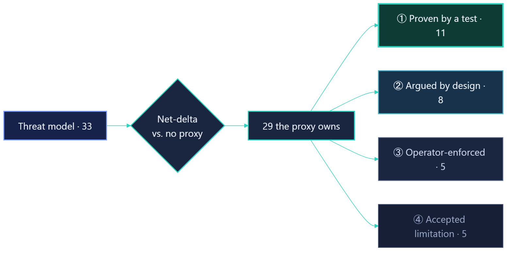

<!-- _class: title -->
<!-- _paginate: false -->
<!-- _footer: "" -->

# Multi-Party Authorization Proxy

### Progress Update 4 — CS 6727 Practicum

Ian Barish

AI use: deck drafted &amp; copy-edited with Claude; research, design, and all project decisions are my own.

<!-- SCRIPT (~10s):
     • "Hi — this is my fourth progress update on the multi-party authorization
       proxy."
     • "Last cycle I built the thing; this cycle I set out to prove it's sound."
       One sentence, then move on — a long intro is the exact thing the TA
       flagged. -->

---

## The Project So Far

A proxy that requires **multiple approvers** to sign off before a sensitive action runs — its headline case is publishing a package to PyPI.

- Researched the problem: one compromised maintainer can ship to everyone
- Wrote the full design — specifications, ADRs, and a threat model
- Built the MVP — it runs end-to-end: **intercept → approve → publish**

<!-- SCRIPT (~30s, HARD CAP — the intro is what got flagged, keep it tight):
     • "Quick recap for anyone who missed a video: this is a proxy that makes
       several people approve a sensitive action before it runs, and the
       headline case is publishing a package to PyPI."
     • "First cycle was research — I showed how one compromised maintainer can
       ship malicious code to everyone downstream."
     • "Second was the full written design — specs, ADRs, and a threat model."
     • "Third, I built it: the MVP now runs end-to-end — it intercepts the
       upload, collects a quorum of approvals, then publishes."
     • Don't retell the story — just set the baseline so this cycle lands. -->

---

## Completed Tasks

Shifted from building the proxy to **proving it's sound** — this cycle was evaluation. Roughly 160 commits and 31 reviewed pull requests.

- **Threat model:** grew to 30+ threats, each classified and bucketed
- **Hardening:** fixed code so more threats are proven by a test
- **Evaluation suite:** runnable, built from the MVP's requirements
- **Live demo:** three acts on a real-world developer stack

<!-- SCRIPT (~90s — the substance, spend the time here):
     • "This cycle I shifted from building the proxy to proving it's sound — the
       whole cycle was about evaluation. It came to roughly 160 commits across 31
       reviewed pull requests."
     • "First, the threat model. I grew it to over thirty threats, and for each
       one I answer two questions — I'll show that on the next slide — then tag it
       and sort it into a bucket."
     • "Second, hardening. Where a threat wasn't actually defended in the code, I
       fixed the code, so more threats moved into the strongest bucket — the ones
       I can prove with a passing test rather than just argue."
     • "Third, I turned that into a runnable evaluation suite, built straight from
       the requirements the MVP had to meet — so 'does it work' is something I run,
       not something I claim."
     • "And fourth, a three-act live demo that stands up the whole stack the way a
       real developer environment looks, so I can show the flow end-to-end in the
       final presentation."
     -->

---

## How I Evaluate the Proxy

<!-- SCRIPT (~25s): walk it left to right, one continuous sentence.
     • "Here's the method. I start with the full threat model — thirty-three
       threats. For each one I ask a net-delta question: compared to publishing
       with NO proxy, does the proxy make this threat better, leave it unchanged,
       or introduce it? The twenty-nine the proxy actually owns then get sorted
       into four buckets by how strongly I defend each — from 'proven by a test'
       at the top down to 'accepted limitation' at the bottom. That spread IS the
       security result." -->

---

## Threat 1 — A Stolen Maintainer Account

Improved · proven by 8 tests

An attacker steals a maintainer's login — the classic supply-chain entry point.

<h4>Without the proxy</h4>That one account publishes to everyone downstream — how many recent attacks began.

<h4>With the proxy</h4>A stolen account is only <strong>one vote</strong> — it can't reach quorum. The other approvers still block it.

<!-- SCRIPT (~30s):
     • "To make that concrete, three example threats — starting with the one the
       whole project exists to fix."
     • "An attacker steals a maintainer's login — a stolen token, a phished
       password. That's how a lot of recent supply-chain attacks start."
     • "Publishing directly, that one account ships malicious code to everyone who
       depends on the package."
     • "Behind the proxy, that same stolen account is worth exactly one vote — it
       can't reach quorum on its own, so the other approvers still stand in the
       way. I prove that with eight tests, including the worst case where all but
       one seat is fully compromised."
     • The key line: "the proxy doesn't make theft less likely — it makes it
       matter less." -->

---

## Threat 2 — Swapping the Package After Approval

Introduced by the proxy · proven by a test

Holding the file for review opens a gap a direct upload never had.

<h4>The new gap</h4>Swap the stored bytes after approval — ship malicious code under the quorum's sign-off.

<h4>How it's closed</h4>Approvers sign a <strong>SHA-256 hash</strong>; the proxy re-checks it at publish. A swap mismatches and is refused.

<!-- SCRIPT (~30s):
     • "Second threat — and this one's honest: the proxy INTRODUCES it. My model
       doesn't just count the threats I fix, it counts the ones I create."
     • "Because the proxy holds the file while people review it, there's a window
       between upload and publish that a plain upload never has. If someone swaps
       the stored bytes after approval, malicious code ships wearing the quorum's
       sign-off."
     • "I close it by binding to the content: approvers approve a specific SHA-256
       hash, and the proxy re-computes and re-checks that hash the instant before
       it publishes. Swapped bytes don't match, and publication is refused — proven
       by tests." -->

---

## Threat 3 — When the Approvers Collude

Accepted limitation · deterrence, not prevention

If a whole quorum conspires, multi-party approval is defeated by definition.

<h4>The threat</h4>m real accounts casting m real votes <em>is</em> a valid approval — the proxy can't tell malice from consensus.

<h4>The honest limit</h4>Can't be prevented in software. But every vote is signed and permanent — collusion is provable after the fact.

<!-- SCRIPT (~30s):
     • "Third threat — and here I have to be honest about a limit. If a full quorum
       colludes, multi-party approval is defeated by definition."
     • "m genuine accounts casting m genuine votes IS a valid approval — there's no
       signal inside the proxy that tells corrupt consensus apart from real
       consensus."
     • "So I don't claim to prevent it. What the proxy does is raise the price:
       every vote is cryptographically signed and permanent, so collusion goes
       from one quiet defector to m people who each leave provable evidence."
     • "I'd rather state a limit like this plainly than paper over it — and that
       honesty is exactly what the net-delta model is for." -->

---

## Next Steps

<h4>Final presentation</h4>Record the video walkthrough of the working system

<h4>Final report</h4>Start drafting — the incident case studies first

<h4>Finishing touches</h4>Last polish on the implementation

<!-- SCRIPT (~60s):
     • "Next steps. First, the final presentation — I'll record a full
       walkthrough of the working system now that the demo stack is ready."
     • "Second, I start writing the final report. I'm beginning with the incident
       case studies — the real supply-chain compromises that motivate the whole
       project — because those are the most self-contained to write and they
       anchor everything after them. Goal is a rough draft by the next report."
     • "Third, a last round of finishing touches on the implementation as I write
       it up and spot rough edges." -->

---

<!-- _class: ask -->

## Feedback Request

My plan
I'm starting my <strong>final report</strong> with a <strong>general-to-concrete</strong> structure: open by framing multi-party approval as a <strong>general idea</strong> — a quorum in front of any sensitive action — then narrow to the one use case I actually built and proved: publishing a package to PyPI.

How would you frame the general part? Should I motivate it with <strong>several example use cases</strong>, and <strong>how deep</strong> do I go on the general idea vs the concrete system?

<!-- SCRIPT (~40s): the video ENDS here — protected slot, do not rush.
     • "Last thing — a question for the group as I start my final report."
     • "My plan is a general-to-concrete structure. I open by framing the core idea
       in general terms — putting a quorum of approvers in front of ANY sensitive
       action, not just publishing. Then I narrow down to the one use case I
       actually built and evaluated: publishing a package to PyPI."
     • "What I'd love input on is that opening. How would you frame the general
       part? Is it worth sketching several example use cases to motivate it — CI
       deploys, infrastructure changes, that kind of thing — or does that dilute
       the focus?"
     • "And how deep would you go on the general idea vs the one
       concrete system I can actually prove? That's the balance I'm trying to
       strike." -->
