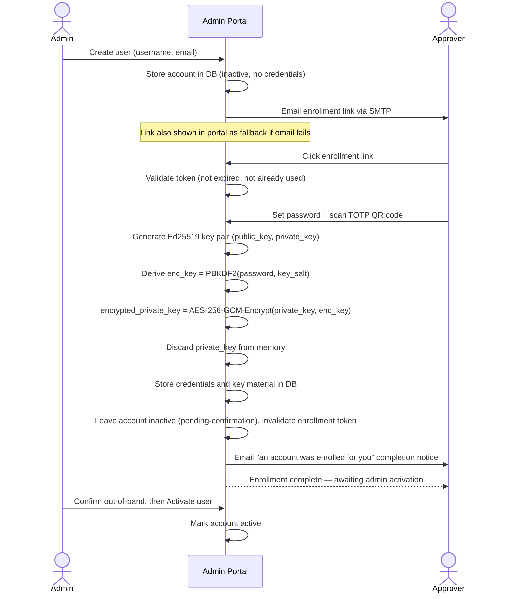

# Account Management & Admin Authentication

This document covers the user account model, authentication factors, account provisioning, the Admin Portal, and credential recovery.

For the per-approval authentication flow and cryptographic signing scheme, see [approver-authentication.md](approver-authentication.md).

For the decision to use credential-backed approval over threshold signatures, see [ADR 0001](adr/0001-credential-backed-approval.md).

---

## User Account Model

Every approver and admin is a **User** stored in the proxy's local database. There are no external identity providers in the MVP (SSO integration is a future idea).

### Users table

| Field | Type | Notes |
|---|---|---|
| `id` | UUID | Primary key |
| `username` | string | Unique; used at login |
| `email` | string | Unique. Used to deliver enrollment link |
| `password_hash` | string | bcrypt hash of the user's password |
| `totp_secret` | bytes | The TOTP shared secret, **AES-256-GCM-encrypted at rest** under the user's password-derived `enc_key` (bound to `id` as AAD), stored as `iv ‖ ciphertext ‖ tag` — the same wrap as the signing key (#122, [cryptography.md](cryptography.md), [threat model](threat-model/HOST-3-database-read-compromise.md) HOST-3). It can be password-wrapped because the proxy only checks TOTP when the password is present (login, per-vote re-auth); it is decrypted transiently for the check and discarded. Null until enrollment sets it |
| `totp_salt` | bytes | The 128-bit PBKDF2 salt for `totp_secret`'s `enc_key` derivation — the secret's **own** salt (not the signing key's), so the verifier reads only this row. Null until enrollment sets it; dropped alongside `totp_secret` on a reset |
| `groups` | string | Optional. Free-text group membership string injected as the `Remote-Groups` header (or its configured equivalent) on forward-auth success. Comma-separated values are conventional (e.g., `"developers,release-managers"`) but the proxy does not interpret the content — it is passed verbatim to the backend. Null if not set |
| `is_admin` | bool | If true, user can access the Admin Portal |
| `is_active` | bool | False at creation **and** after enrollment completes — enrollment lands the account in *pending-confirmation* (#128); an admin flips it true via [Activate user](#admin-portal-capabilities-mvp) after confirming out-of-band. Also set false to deactivate. Mode-B pre-credentialed provisioning is the one path born active |
| `created_at` | timestamp | When the account was created by an admin |
| `enrolled_at` | timestamp | When the user completed enrollment (null until then) |

There is no separate admin account type. Admin is a flag on a regular user account. Admins authenticate with the same mechanism as approvers (password + TOTP).

### User keys table

Key pairs are stored separately, so a user can accumulate multiple key pairs over their lifetime (one generated at enrollment, a new one generated on each password reset). Approval records reference the specific key used to sign them (`votes.key_id` = `user_keys.id`), allowing audit verification regardless of how many resets have occurred.

The **active** key — the one new approvals are signed with — is **derived, not pointed at**: it is the user's row with `revoked_at IS NULL`. A partial unique index (`user_id` where `revoked_at IS NULL`) guarantees at most one active key per user, so there is no `users.current_key_id` pointer to keep in sync. A user may transiently have *no* active key (after a reset retires the old one, before re-enrollment mints a new one).

| Field | Type | Notes |
|---|---|---|
| `id` | UUID | Primary key; referenced by approval records as `key_id` |
| `user_id` | UUID | Foreign key to users table |
| `public_key` | string | Ed25519 public key; retained permanently for audit |
| `encrypted_private_key` | string | `AES-256-GCM(private_key, PBKDF2(password, key_salt))`; deleted on password reset or account deletion |
| `key_salt` | string | Random salt for this key's encryption key derivation |
| `created_at` | timestamp | When this key pair was generated |
| `revoked_at` | timestamp | When this key was superseded or the account was reset; null = currently active key |

**Active-key lifecycle.** A user has no active key until enrollment completes, which inserts the enrollment-generated key (active, `revoked_at` null). A **credentials reset retires the active key** — its `encrypted_private_key` and `key_salt` are dropped and its `revoked_at` is stamped, so it can no longer sign, but its `public_key` is retained so every approval it already signed stays verifiable — leaving the user with no active key until **re-enrollment inserts a fresh one**. On **account deletion**, the active key is retired the same way (private half dropped, public retained) and the account is deactivated; all key rows are kept for audit. Retirement is also *necessary* on reset: the password-derived key wrap ([User keys table](#user-keys-table), `encrypted_private_key`) means the old key cannot be re-wrapped under the new password without the old password, which a reset does not have. The biconditional "a retired key keeps only its public half" is enforced by a CHECK constraint.

### API tokens table

A User may hold **multiple** API Tokens (one-to-many under User), one per machine or context (e.g., `"work laptop"`, `"CI runner"`). Each token is stored only as a **hash** — the plaintext is shown **once** at creation and is never retrievable afterward. Each token is individually revocable without affecting the User's password, TOTP, or other tokens.

The token hash is a plain cryptographic hash (SHA-256), deliberately **not** a password-stretching KDF (bcrypt / PBKDF2). API tokens are high-entropy random values, so there is nothing to brute-force; stretching would add cost with no security benefit. This is the opposite of passwords, which use bcrypt precisely because they are low-entropy and must be made expensive to guess.

**Token authentication is gated on the owning User's `is_active`, checked at request time.** A token presented by a deactivated User is rejected regardless of its own `revoked_at` status. This is what lets deactivation contain a leaked CI/upload token immediately (PRD story 20) without the admin having to enumerate and revoke each token individually — and it also covers any token minted before the deactivation event.

| Field | Type | Notes |
|---|---|---|
| `id` | UUID | Primary key |
| `user_id` | UUID | Foreign key to users table |
| `token_hash` | string | Hash of the API token; the plaintext is shown once at creation and never stored |
| `label` | string | Human-readable label identifying the machine/context (e.g., `"CI runner"`) |
| `created_at` | timestamp | When the token was created |
| `revoked_at` | timestamp | When the token was revoked; null = currently active |

### Sessions table

Proxy Sessions are **server-side, revocable records** — not stateless signed cookies. A session row is the authoritative record of a logged-in User; the cookie carries only the **signed session `id`**. Deleting a session row (logout, or user deactivation) revokes access **immediately**, because the next request finds no matching row. This applies to **all** Users, not just admins.

| Field | Type | Notes |
|---|---|---|
| `id` | string | Primary key — a 256-bit URL-safe random token; the value carried (HMAC-signed) in the session cookie |
| `user_id` | UUID | Foreign key to users table |
| `created_at` | timestamp | When the session was created at login |
| `expires_at` | timestamp | When the session expires (see `session_expiry_hours` in [config.md](config.md)) |

---

## Authentication Factors

Every user authenticates with two factors:

1. **Password** — verified against `password_hash` using bcrypt. Minimum length is configurable (default: 12 characters). Because **bcrypt silently truncates its input at 72 bytes**, passwords are **capped at 72 bytes** at enrollment and reset, so bcrypt verification and the PBKDF2 key-wrap ([approver-authentication.md](approver-authentication.md)) operate on the *same* bytes — avoiding a state where login verifies only the first 72 bytes while key derivation uses the full string. (See [ADR 0003](adr/0003-cryptographic-primitive-selection.md).)
2. **TOTP (Time-based One-Time Password)** — a 6-digit code generated by an authenticator app (Google Authenticator, Authy, etc.) using the user's `totp_secret`. The secret is **encrypted at rest** under the password-derived `enc_key` (#122), so the verifier decrypts it transiently — using the password submitted alongside — before checking the code, then discards it. The proxy accepts codes within a configurable clock-skew window — `auth.totp_window` time steps on either side of now (default: 1, i.e. a 90-second window; see [config.md](config.md)).

Both factors must pass before any action is taken. There is no fallback to password-only authentication.

---

## Account Provisioning Flow

An admin creates approver accounts through the Admin Portal. The approver then self-enrolls via a one-time link. The admin never sees the approver's password or TOTP secret.

**Pending-confirmation gate (#128, [IDENT-2](threat-model/IDENT-2-enrollment-link-interception.md)).** Completing enrollment no longer activates the seat: the account lands **inactive** (`is_active = false`, enrolled with keys set), and an admin flips it active only after confirming out-of-band that the intended human is who enrolled. This converts an intercepted enrollment link from a silent identity takeover into a race the attacker loses loudly — the seat cannot log in or vote before the admin's confirmation, and on completion the registered address receives an "an account was enrolled for you — if this wasn't you, contact your admin" notice (`account.enrollment_completed`). Mode-B pre-credentialed provisioning is exempt: it is born active by construction and never passes through enrollment.

### Declarative (config-driven) provisioning

Besides the interactive Admin-Portal "Create user", users can be declared in a credential-bearing **`users.yaml`** that the proxy reconciles **create-if-absent** on every boot. This runs as an explicit **bootstrap step** (`msig-provision`), not in the app factory — the factory is deliberately side-effect-free and writes nothing to the database — so the container entrypoint runs it after `alembic upgrade head` and before serving, and a local `uvicorn` bootstraps identically by running the same command. It resolves the **first-admin paradox** (no admin exists to create the first admin) by treating the config as the trusted authority, equivalent to an admin's "Create user". The file path, schema, and trust posture are specified in [config.md](config.md) §`users.yaml`; the reconciliation is **additive-only** (match by `username`; an existing user in any state is left untouched — never resurrected, mutated, or re-issued a link; no deletion or field updates).

Each declared user is created in one of two modes:

- **(A) identity-only** *(default)* — created inactive with no credentials, exactly as the Admin-Portal "Create user" does, emitting `account.enrollment_issued` so the user receives a single-use enrollment link and self-enrolls (the flow above). No password lives in the file. Preferred for general approvers.
- **(B) pre-credentialed** — created **already enrolled** (active, with a password, TOTP secret, and an active signing key) from credential material generated **offline** by the `hash-credentials` helper. No SMTP and no enrollment click are involved — this is what bootstraps the first admin, CI identities, and demos without a mail server.

Mode B carries the **full enrolled bundle** because in this system the password is load-bearing three ways (see [User keys table](#user-keys-table) and [approver-authentication.md](approver-authentication.md)): it is the bcrypt login verifier, the PBKDF2 input that wraps the user's Ed25519 signing key, **and** — since #122 — the PBKDF2 input that wraps the TOTP secret. A bare password hash would yield a user who can log in but **cannot approve** (no signing key) or **cannot pass the second factor** (no readable TOTP secret), so `hash-credentials` reuses the exact enrollment crypto to emit a bundle whose stored bytes are byte-for-byte identical to a normal enrollment. The bundle is **id-stable**: it carries the `id` (the inserted `users.id`) and `key_id`, because the wrapped TOTP secret is AES-GCM AAD-bound to `users.id` and the wrapped private key to `user_keys.id` ([cryptography.md](cryptography.md)); the inserted rows must use those exact ids or the first login / first signature fails. The bundle therefore holds the second factor as `encrypted_totp_secret` + `totp_salt` (ciphertext, safe to commit) rather than a plaintext secret; the `public_key` is emitted rather than derived because it is derivable only from the *plaintext* private key, which is never stored — `hash-credentials` has the plaintext at generation and so emits the public half then.

### Enrollment Link Properties

Enrollment tokens are **high-entropy random values stored hashed** — not stateless signed blobs. The proxy persists each token's hash alongside an expiry and a **single-use/consumed flag**; validation hashes the presented token and checks the stored record is unexpired and unconsumed. As with API tokens, the stored hash is a plain cryptographic hash (SHA-256), not a password-stretching KDF: the token is already high-entropy, so stretching would add cost with no security benefit.

#### Enrollment tokens table

| Field | Type | Notes |
|---|---|---|
| `id` | UUID | Primary key |
| `user_id` | UUID | Foreign key to users table |
| `token_hash` | string | SHA-256 of the enrollment token; the plaintext appears once in the emailed link and is never stored |
| `expires_at` | timestamp | When the link expires (default 24h; see `enrollment_link_expiry_hours` in [config.md](config.md)) |
| `consumed_at` | timestamp | Set when enrollment completes; null = unconsumed. The **check-and-set is atomic** — a single transaction verifies `consumed_at IS NULL` and sets it, so concurrent clicks on the same link cannot both enroll |
| `created_at` | timestamp | When the link was issued |

- **Format:** `https://proxy.example.com/enroll/{token}` where `token` is a cryptographically random 256-bit value. Only its hash is stored.
- **Delivery:** The proxy emails the link directly to the approver's registered email address via SMTP on account creation. The Admin Portal also displays the link as a fallback if email delivery fails.
- **Expiry:** Configurable; default 24 hours from creation. The expiry is recorded on the stored token record.
- **Single-use:** A consumed flag is set immediately after the approver completes enrollment, so the token cannot be replayed.
- **If expired:** Admin generates a new enrollment link via the Admin Portal. The account remains inactive.

---

## Admin Portal

The Admin Portal is accessible at `https://proxy.example.com/admin`. Access requires a user account with `is_admin = true`. Authentication uses the same password + TOTP flow as approver authentication, and results in a Proxy Session (server-side, revocable; see the [sessions table](#sessions-table) and `session_expiry_hours` in [config.md](config.md), default 8 hours).

**Step-up re-authentication on sensitive actions (#135, [IDENT-1](threat-model/IDENT-1-admin-account-compromise.md), [VOTE-1](threat-model/VOTE-1-proxy-session-hijacking.md)).** A valid admin session alone does **not** authorize the enrollment / credential / roster mutations. The six sensitive actions — **Create user, Edit user, Reset credentials, Regenerate enrollment link, Deactivate, Delete** — additionally demand a **fresh password + single-use TOTP**, verified through the exact same `verify_credentials` path (and single-use TOTP burn) as per-vote re-authentication; a session that clears `is_admin` but fails or omits the second factor gets a `401` (indistinguishable across which factor failed). This caps a stolen or hijacked admin *session* (VOTE-1) at its non-admin outcome — lacking the second factor, it can view the portal but cannot drive the enroll-forward roster takeover — and is the prevention counterpart to the admin-action alarm (#125, detection). **Activate user** and **admin token-revoke** stay **session-only**: activation *is* the out-of-band confirmation step (#128), and revocation is a containment action that must not be gated on a second factor.

### Admin Portal vs. User Portal

The proxy has two distinct authenticated surfaces:

- **Admin Portal** (`/admin`) — **account administration**, restricted to `is_admin` Users. Manages *other* Users' accounts: provisioning, deactivation, credential reset. An admin is deliberately kept out of the credential path — they may revoke a User's API Tokens but cannot create or view them.
- **User Portal** (`/account`) — **self-service**, available to any enrolled User regardless of `is_admin`. Organized by capability rather than role, because one User is simultaneously a Requester and an Approver: a User manages their own API Tokens, tracks the Approval Requests they created (cancelling ones still `pending`), and reviews/changes their own Votes on requests they may approve. The User Portal is specified in [web-proxy.md](web-proxy.md); casting, changing, or withdrawing a Vote always routes through the re-authentication approval flow.

### Admin Portal Capabilities (MVP)

The six roster/credential mutations below — **Create user, Edit user, Deactivate user, Delete user, Reset credentials, Regenerate enrollment link** — each require **step-up re-authentication** (fresh password + single-use TOTP) on top of the admin session, per [Step-up re-authentication](#admin-portal) above. **Activate user** and **Revoke a user's API tokens** are session-only.

- **Create user:** Enter username, email, and optionally a `groups` value; system emails an enrollment link. Requires step-up re-auth.
- **View users:** List all accounts with status (active, inactive, admin flag, groups).
- **Edit user:** Update `groups` (and any other non-credential fields) without resetting credentials.
- **Activate user:** Set `is_active = true` for an enrolled, pending-confirmation account (#128) — the admin's out-of-band confirmation that the intended human is the one who enrolled. **Refused (`409`) for an account that has not completed enrollment**: pre-activating would let the next click on the enrollment link complete straight into a live seat, defeating the gate. This same endpoint re-activates a deactivated account. Emits `account.activated`.
- **Deactivate user:** Set `is_active = false` immediately; any in-flight approval links for that user are invalidated, their Proxy Sessions are revoked (session rows deleted), and any outstanding enrollment links are voided (a live link would otherwise let its holder set the deactivated account's credentials, TOTP, and signing key — even though a completed enrollment now only reaches pending-confirmation, #128). Because **token authentication and vote acceptance both re-check `is_active` at request time** (see [API tokens](#api-tokens-table)), a leaked CI/upload token stops working the instant the account is deactivated, and a vote already past the re-auth gate is rejected at write time if the approver was deactivated in the interim. Reversible — reactivate via **Activate user**, all credentials intact.
- **Delete user:** Irreversible. Removes `encrypted_private_key` (signing capability revoked) but retains `public_key` so historical approval records remain verifiable. Outstanding enrollment links are voided — the retained row must not be re-enrollable.
- **Reset credentials:** Invalidate the user's current password and TOTP; generate a new enrollment link. Any prior unconsumed enrollment link is voided.
- **Regenerate enrollment link:** Generate a new link for a user who has not yet enrolled or whose link expired. Regeneration **invalidates the previous link** — at most one enrollment link is live per user, so reissuing after a suspected interception is a real remediation, not just a fresh copy.
- **Revoke a user's API tokens:** Revoke any of a User's API Tokens (e.g., on suspected compromise). Admins may revoke but **cannot create or view** a User's tokens — this keeps the admin out of the credential path; token creation and inspection live in the User Portal.

---

## Account Events

Account-management operations emit **events** the same way the [request lifecycle](request-lifecycle.md) does. This document is the source of truth for account events; the [notification system](notification-system.md) **delivers their notifications** rather than redefining the catalog (by direct best-effort calls in the MVP — see [notification-system.md § Event sources](notification-system.md)). The `account.*` events are emitted on the bus, where the audit subscriber records them. Account events are distinct from request-lifecycle events: they concern a User's account, not an Approval Request.

Each event names the **affected User** as its subject. Notification delivery (SMTP, portal fallback, default subscriptions) is specified in [notification-system.md](notification-system.md). Like the request-lifecycle events, these are **typed frozen dataclasses** in `core/events.py` ([ADR 0014](adr/0014-typed-lifecycle-events.md)) — the dataclass is the PascalCase of the name (e.g. `account.enrollment_issued` → `EnrollmentIssued`), each carrying `user_id: UUID` and `email: str`; the `account.*` string is the audit-trail label, not the dispatch discriminator.

| Event | Dataclass | Fires when | Subject |
|---|---|---|---|
| `account.enrollment_issued` | `EnrollmentIssued` | An admin creates a user, or regenerates an enrollment link for a user who has not yet enrolled or whose link expired | The new/pending User — carries the enrollment link |
| `account.credentials_reset` | `CredentialsReset` | An admin resets a user's credentials (invalidates password + TOTP, issues a fresh enrollment link) | The affected User — carries the new enrollment link |
| `account.enrollment_completed` | `EnrollmentCompleted` | An enrollee finishes `/enroll/{token}` — account enters pending-confirmation (#128) | The affected User — informational "an account was enrolled for you" notice |
| `account.groups_changed` | `AccountEdited` | An admin edits a User's `groups` and/or `email` via `PATCH /admin/users/{id}` — a no-op edit (no field changed) emits nothing | The affected User — carries `changes` (the mutated fields); alarms admins (#125) |
| `account.activated` | `AccountActivated` | An admin activates a pending-confirmation (or deactivated) account | The affected User |
| `account.deactivated` | `AccountDeactivated` | An admin sets `is_active = false` | The affected User |
| `account.deleted` | `AccountDeleted` | An admin irreversibly deletes the account | The affected User |

`account.enrollment_issued` and `account.credentials_reset` both deliver an enrollment link (a credentials reset *is* a fresh enrollment). `account.enrollment_completed`, `account.deactivated`, and `account.deleted` deliver an informational "contact your admin" message — they carry no link and grant no capability. `account.enrollment_completed` is self-service (no admin actor); it is leg (b) of the IDENT-2 detection defense (#128). `account.activated` is emitted for audit and carries no notification (the admin has just confirmed with the human out-of-band).

**Admin-action alarm (IDENT-1, #125).** The *enrollment-affecting* roster mutations — `account.enrollment_issued`, `account.credentials_reset`, and `account.groups_changed` — additionally fan an alarm to **all active admins** (over and above the affected-User notification). This converts the *quiet* enroll-forward takeover (an admin, or a hijacked admin session per [VOTE-1](threat-model/VOTE-1-proxy-session-hijacking.md), enrolls new attacker-controlled approvers to manufacture quorum) from journal-only to alarmed: an admin who did not perform the action sees the roster change. The audience is *all* admins, not all-but-the-actor — alerting the actor is exactly how a stolen admin session reaches its real owner. The alarm is suppressed when the mutation has no admin actor (`actor_id` null — declarative provisioning), and it is best-effort; the durable counterpart is the `account.*` audit row. See [notification-system.md § Account events](notification-system.md).

> The catalog remains open to further account events; it is intentionally minimal for MVP.

---

## Credential Recovery

There is no self-service credential recovery. If an approver forgets their password or loses access to their authenticator app, they contact an admin. The admin verifies their identity out-of-band (phone call, in person) and then uses the Admin Portal to reset the account and issue a new enrollment link.

This keeps the credential trust boundary clean: account access is always gated by a human decision.

There is also **no self-service password change** in the MVP — the User Portal exposes no change-password flow. A password change happens only via an admin-initiated credentials reset, which issues a fresh enrollment link and, as noted in the [active-key lifecycle](#user-keys-table), **necessarily retires the prior signing key** (re-enrollment generates a new pair; past signatures remain verifiable via the retained `public_key`).

---

## Configuration Reference

All authentication parameters are documented in [docs/config.md](config.md).
