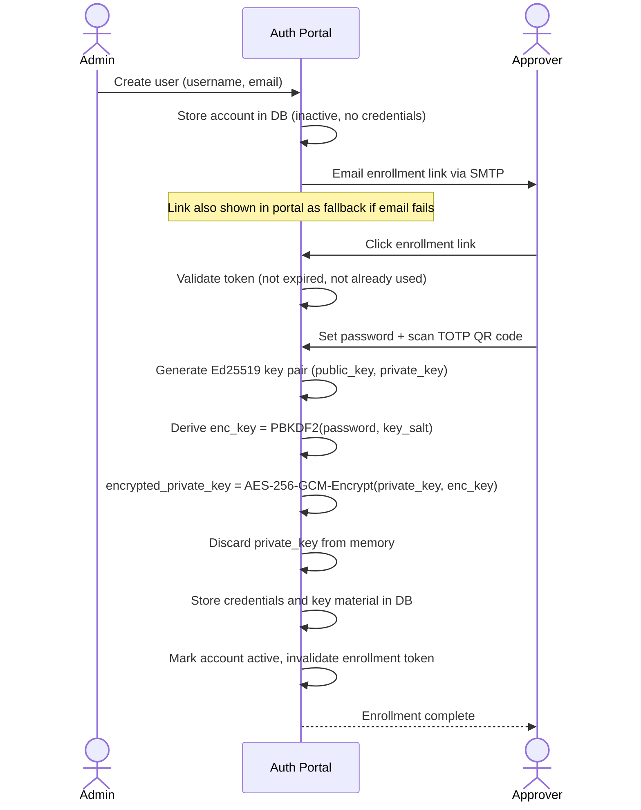

# Account Management & Admin Authentication

This document covers the user account model, authentication factors, account provisioning, the authentication portal, and credential recovery.

For the per-approval authentication flow and cryptographic signing scheme, see [approver-authentication.md](approver-authentication.md).

For the decision to use credential-backed approval over threshold signatures, see [ADR 0001](adr/0001-credential-backed-approval.md).

---

## User Account Model

Every approver and admin is a **User** stored in the proxy's local database. There are no external identity providers in the MVP (SSO integration is a future idea).

### Users table

| Field | Type | Notes |
|---|---|---|
| `id` | UUID | Primary key |
| `username` | string | Unique; used at login |
| `email` | string | Used to deliver enrollment link |
| `password_hash` | string | bcrypt hash of the user's password |
| `totp_secret` | string | Shared secret for TOTP; stored encrypted at rest |
| `current_key_id` | UUID | Foreign key to `user_keys.id`; the key pair used for signing new approvals. Null until enrollment is complete |
| `is_admin` | bool | If true, user can access the authentication portal |
| `is_active` | bool | False until enrollment is complete; set to false to deactivate |
| `created_at` | timestamp | When the account was created by an admin |
| `enrolled_at` | timestamp | When the user completed enrollment (null until then) |

There is no separate admin account type. Admin is a flag on a regular user account. Admins authenticate with the same mechanism as approvers (password + TOTP).

### User keys table

Key pairs are stored separately, so a user can accumulate multiple key pairs over their lifetime (one generated at enrollment, a new one generated on each password reset). Approval records reference the specific key used to sign them, allowing audit verification regardless of how many resets have occurred.

| Field | Type | Notes |
|---|---|---|
| `id` | UUID | Primary key; referenced by approval records as `key_id` |
| `user_id` | UUID | Foreign key to users table |
| `public_key` | string | Ed25519 public key; retained permanently for audit |
| `encrypted_private_key` | string | `AES-256-GCM(private_key, PBKDF2(password, key_salt))`; deleted on password reset or account deletion |
| `key_salt` | string | Random salt for this key's encryption key derivation |
| `created_at` | timestamp | When this key pair was generated |
| `revoked_at` | timestamp | When this key was superseded or the account was reset; null = currently active key |

---

## Authentication Factors

Every user authenticates with two factors:

1. **Password** — verified against `password_hash` using bcrypt. Minimum length is configurable (default: 12 characters).
2. **TOTP (Time-based One-Time Password)** — a 6-digit code generated by an authenticator app (Google Authenticator, Authy, etc.) using the user's `totp_secret`. The proxy accepts codes within ±1 time step (90-second window) to tolerate clock drift.

Both factors must pass before any action is taken. There is no fallback to password-only authentication.

---

## Account Provisioning Flow

An admin creates approver accounts through the authentication portal. The approver then self-enrolls via a one-time link. The admin never sees the approver's password or TOTP secret.

### Enrollment Link Properties

- **Format:** `https://proxy.example.com/enroll/{token}` where `token` is a cryptographically random 256-bit value.
- **Delivery:** The proxy emails the link directly to the approver's registered email address via SMTP on account creation. The authentication portal also displays the link as a fallback if email delivery fails.
- **Expiry:** Configurable; default 24 hours from creation.
- **Single-use:** Invalidated immediately after the approver completes enrollment. Cannot be replayed.
- **If expired:** Admin generates a new enrollment link via the authentication portal. The account remains inactive.

---

## Authentication Portal

The authentication portal is accessible at `https://proxy.example.com/admin`. Access requires a user account with `is_admin = true`. Authentication uses the same password + TOTP flow as approver authentication, but results in a persistent admin session (cookie-based, configurable expiry, default 8 hours).

### Authentication Portal Capabilities (MVP)

- **Create user:** Enter username and email; system emails an enrollment link.
- **View users:** List all accounts with status (active, inactive, admin flag).
- **Deactivate user:** Set `is_active = false` immediately; any in-flight approval links for that user are invalidated. Reversible — account can be reactivated with all credentials intact.
- **Delete user:** Irreversible. Removes `encrypted_private_key` (signing capability revoked) but retains `public_key` so historical approval records remain verifiable.
- **Reset credentials:** Invalidate the user's current password and TOTP; generate a new enrollment link.
- **Regenerate enrollment link:** Generate a new link for a user who has not yet enrolled or whose link expired.

---

## Credential Recovery

There is no self-service credential recovery. If an approver forgets their password or loses access to their authenticator app, they contact an admin. The admin verifies their identity out-of-band (phone call, in person) and then uses the authentication portal to reset the account and issue a new enrollment link.

This keeps the credential trust boundary clean: account access is always gated by a human decision.

---

## Configuration Reference

All authentication parameters are documented in [docs/config.md](config.md).
