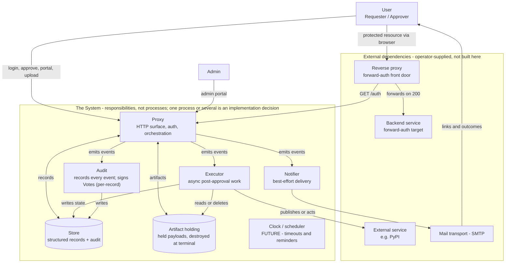

# System Architecture

This document ties the whole system together: the components that exist, what each is responsible for, the external things they depend on, and how a request flows end-to-end for each use case. It is the map; the detailed specs it points to are the territory.

## How to read this document

- **Responsibilities, not processes.** Each box below is a *responsibility* — a job the system does. It is **not** a claim about deployment. One Python process could own every box, or they could be split across several; that is an implementation decision deferred to build time. The dashed boundary on the topology diagram means exactly this: "one process or several."
- **Responsibilities, not products.** The stack is now selected in [ADR 0011](adr/0011-technology-stack.md), but this document still names each box by what it *does* — how the Store persists, what carries mail, where artifacts are held — never by a product. The boxes are the seams a technology drops into; keeping them product-neutral here is what lets the SQLite→Postgres swap (and similar) stay a localized change rather than a rewrite.
- **The specs are authoritative.** This document does not redefine states, events, endpoints, or crypto. Each section links to the spec that owns those details.

## Component topology

### What each box is responsible for

| Box | Responsibility | Authoritative spec |
|---|---|---|
| **Proxy** | Terminates HTTP, authenticates Users, serves the login / waiting-room / approve / User Portal / Admin Portal surfaces, and orchestrates the request lifecycle. The hub everything hangs off. | [web-proxy.md](web-proxy.md) |
| **Store** | One logical store for all structured records — users, keys, approval requests, votes, service grants, actions, sessions, API tokens, enrollment tokens — **and** the signed audit trail. | [account-management.md](account-management.md), [request-lifecycle.md](request-lifecycle.md) |
| **Artifact holding** | Holds an uploaded payload (e.g. a package) between upload and a terminal outcome, then deliberately destroys it **on every terminal path, with an owning actor per terminal state** (the Executor on the `approved` path; the Approval Request's terminal handler on `denied`/`cancelled`), emitting `artifact.destroyed`. Separate from the Store because its contents are bulk binary, its lifecycle is held-then-destroyed, and it is hash-bound and security-relevant in its own right. | [web-proxy.md](web-proxy.md), [request-lifecycle.md](request-lifecycle.md) |
| **Executor** | Performs post-approval work asynchronously — runs an Action against an external service (with bounded retry), or issues a Service Grant. Triggered by `request.approved`; never rides an Approver's HTTP request. | [request-lifecycle.md](request-lifecycle.md) |
| **Notifier** | Best-effort subscriber: renders and delivers messages. A failed or delayed notification never blocks the lifecycle. | [notification-system.md](notification-system.md) |
| **Audit** | Critical subscriber: records every event. Each **Vote/approval record** is Ed25519-signed and offline-verifiable against later database tampering — **per-record** tamper-evidence (no hash chain in MVP, so whole-record deletion or reorder is not cryptographically detected; see [cryptography.md](cryptography.md)). Non-vote events are recorded, not approver-signed. | [request-lifecycle.md](request-lifecycle.md), [cryptography.md](cryptography.md), [approver-authentication.md](approver-authentication.md) |
| **Clock / scheduler** | *(Future, not wired in the MVP.)* Observes time passing for approval timeouts and reminders. In the MVP nothing watches the clock — grant expiry is evaluated lazily at `/auth`. | [#30](https://github.com/Ian-Costa18/Cybersecurity-Practicum/issues/30), [#31](https://github.com/Ian-Costa18/Cybersecurity-Practicum/issues/31) |

### Actors and external dependencies

- **User** — a single account that plays whichever role the moment calls for: **Requester** when seeking access or submitting an artifact, **Approver** when voting on someone else's request. The same person is routinely both, across different Services.
- **Admin** — a User with `is_admin`; administers accounts via the Admin Portal. Holds no power to approve.
- **Reverse proxy / Backend service** — the operator's forward-auth front door and the internal app behind it. The proxy answers the reverse proxy's `/auth` subrequest; the reverse proxy (not the proxy) forwards the request to the backend on a `200`.
- **External service** — the one-time Action target (e.g. PyPI), reached by the Executor after quorum.
- **Mail transport** — carries notifications. Best-effort; if it fails, link-bearing notifications fall back to the portal.

## The event-driven seam

The Proxy advances the lifecycle and **emits events blind** — it does not know who is listening ([ADR 0005](adr/0005-decoupled-notification-system.md)). Three consumers subscribe, in two reliability classes ([request-lifecycle.md](request-lifecycle.md)):

- **Critical** — a missed event is a fault. **Audit** (records every event) and the **Executor** (turns `request.approved` into a Service Grant or an Action) must not be best-effort.
- **Best-effort** — a missed event is recoverable. The **Notifier** delivers messages; its failure never touches the lifecycle.

This seam is why Executor, Notifier, and Audit are separate boxes: they consume the same events with different guarantees.

## Request flows

The system serves two end-to-end flows, one per use case. Each is documented — narrative plus sequence diagram — in its own use-case document, so the behavior lives in exactly one place:

- **Forward-auth** (interactive access to a protected backend): [use-cases/02-shared-account-management.md](use-cases/02-shared-account-management.md).
- **One-time** (submit-then-publish, e.g. PyPI): [use-cases/01-package-publishing.md](use-cases/01-package-publishing.md).

For the HTTP-surface mechanics underneath both — endpoints, identity headers, status codes, session and resume behavior — see [web-proxy.md](web-proxy.md); for the state machine they move through, see [request-lifecycle.md](request-lifecycle.md).

## Data: one logical Store, one artifact store

For the MVP the system keeps a **single logical Store** for every structured record and the audit trail. Audit is still a distinct *responsibility* — the critical consumer that signs every event — but its records live in the shared Store; they are not physically partitioned. **Artifact holding** is the one deliberate split: bulk payloads sit apart from structured records, with a held-then-destroyed lifecycle.

Both are technology-deferred. At production scale the artifact side would naturally become object storage (content-addressed by the hash already computed, with lifecycle expiry mirroring "destroy at terminal"), and the audit trail might move to an external write-once log — but those are explicitly future, not MVP.

## What is deliberately *not* here (MVP)

The diagram omits some boxes on purpose, so their absence is not mistaken for an oversight:

- **No Clock / scheduler.** Approval timeouts and reminders are future; grant expiry is evaluated lazily at `/auth`. Nothing watches the clock in the MVP.
- **No external append-only audit store.** The signed audit trail lives in the single Store; a write-once external log is a future hardening (a planned defense under [T6 — Database Write Compromise](threat-model.md)).
- **No multi-backend notification.** The Notifier delivers email only in the MVP; additional channels are future ([#20](https://github.com/Ian-Costa18/Cybersecurity-Practicum/issues/20)).

## Cross-references

- Glossary of every term used here: [CONTEXT.md](../CONTEXT.md)
- What is in and out of MVP scope: [mvp.md](mvp.md)
- Request/approval state machine and events: [request-lifecycle.md](request-lifecycle.md)
- HTTP surface and flows: [web-proxy.md](web-proxy.md)
- Threats and defenses: [threat-model.md](threat-model.md)
- Architectural decisions: [adr/](adr/)
