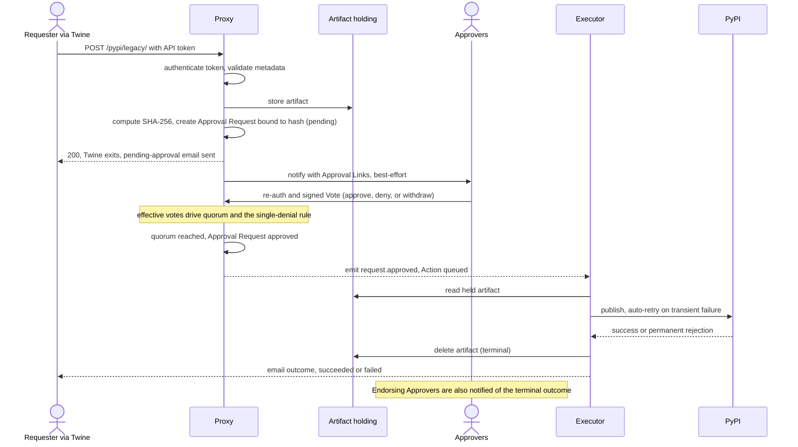

# Use Case: Package Publishing (Supply-Chain Security)

## Problem

A single developer can publish a malicious or backdoored version of a package to npm, PyPI, RubyGems, or other package repositories. Historical incidents:

- **event-stream (npm, 2018):** New maintainer added a malicious transitive dependency that harvested credentials from Bitcoin wallets. ~1.5M weekly downloads; undetected for two months.
- **ctx (PyPI, 2022):** Attacker registered the expired domain of the original maintainer, reset credentials, and published malicious versions exfiltrating AWS keys. ~27,000 copies downloaded.
- **XZ Utils (2024):** Attacker social-engineered co-maintainer status and shipped obfuscated build logic that backdoored sshd (CVSS 10.0).

**The core issue:** The "publish" action is unilaterally controlled by one account. Compromising one maintainer compromises all users of that package.

## Solution

Require multiple maintainers to explicitly approve each release before it is published. The package is cryptographically bound to the approval, preventing tampering between submission and publication.

## Workflow

1. **Developer** uploads the package with Twine, pointed at the proxy's `POST /pypi/legacy/` endpoint, presenting a proxy-issued API token via HTTP Basic Auth (`__token__` : `<token>`).
2. The proxy authenticates the token, validates the package metadata, and stores the artifact in artifact holding.
3. The proxy computes the artifact's SHA-256 and creates an Approval Request bound to that hash (`pending`). Twine receives an immediate `200` and exits; the requester is emailed a "received, pending approval" notice.
4. The proxy notifies approvers (configured by the maintainers) with Approval Links (best-effort).
5. Each **Approver** re-authenticates per approval (password + TOTP) and casts a signed Vote (approve, deny, or withdraw). Effective votes drive quorum and the single-denial rule.
6. Once **quorum is reached** (maintainers choose the threshold), the Approval Request becomes `approved` and hands off to an Action that a background Executor runs asynchronously: it reads the held artifact and publishes to PyPI, auto-retrying on transient failure and giving up on permanent rejection.
7. On a terminal outcome the artifact is deleted from holding and the requester is emailed the result (succeeded or failed); endorsing approvers are also notified of the outcome.



## Configuration (YAML)

The maintainers define who the approvers are and what quorum is required:

```yaml
services:
  pypi-publish:
    approvers:
      - alice  # Maintainer
      - bob    # Maintainer
      - carol  # Maintainer
    quorum: 2  # Maintainers choose: can be 1, 2, 3, etc.
    type: one-time
    action: publish-to-pypi
```

**Quorum is user-configured.** Different packages/organizations may choose different thresholds based on risk and team size.

## Security Properties

- **Hash binding:** Package is hashed immediately upon upload. Approvers approve that specific hash. Even if the proxy is compromised, the package cannot be modified before publication.
- **Quorum-based:** Attacker must compromise m-of-n approvers, not just 1. Raises the attack cost from "compromise one identity" to "compromise m identities."
- **No key management burden:** Approvers use existing credentials (password + 2FA). No additional secrets to manage.
- **Audit trail:** Every approval is logged with timestamp, approver identity, and package hash. Allows forensic analysis and compliance audits.

## Threat Model

**Before:** Attacker compromises one maintainer → publishes backdoored code to all users (global impact).

**After:** Attacker compromises one maintainer → cannot publish without m-1 additional approvers. Must either:
- Compromise m-1 more maintainers (higher cost, lower probability)
- Convince m-1 maintainers to approve malicious code (requires social engineering)
- Compromise the proxy to forge approvals (detected in audit log if approvals don't match recorded auth events)

## Real-World Applicability

This use case is implementable because:
- The project has conducted rigorous research (literature review in `Research/Broad Literature Review.md`) showing supply-chain attacks that multi-approval would have prevented
- The workflow is simple: upload → approve → publish
- The threat model is clear and grounded in real incidents
- The quorum is configurable, allowing different maintainers to choose their own risk/friction trade-off

## Evaluation Questions

- **Usability:** Is the approval process smooth enough that maintainers adopt it?
- **Performance:** Does hash binding introduce acceptable latency?
- **Audit:** Is the logged approval trail sufficient for compliance (SLSA, PCI-DSS, etc.)?
- **Comparative benefit:** Does requiring m-of-n approval genuinely raise the cost of supply-chain attacks compared to status quo (single maintainer)?
