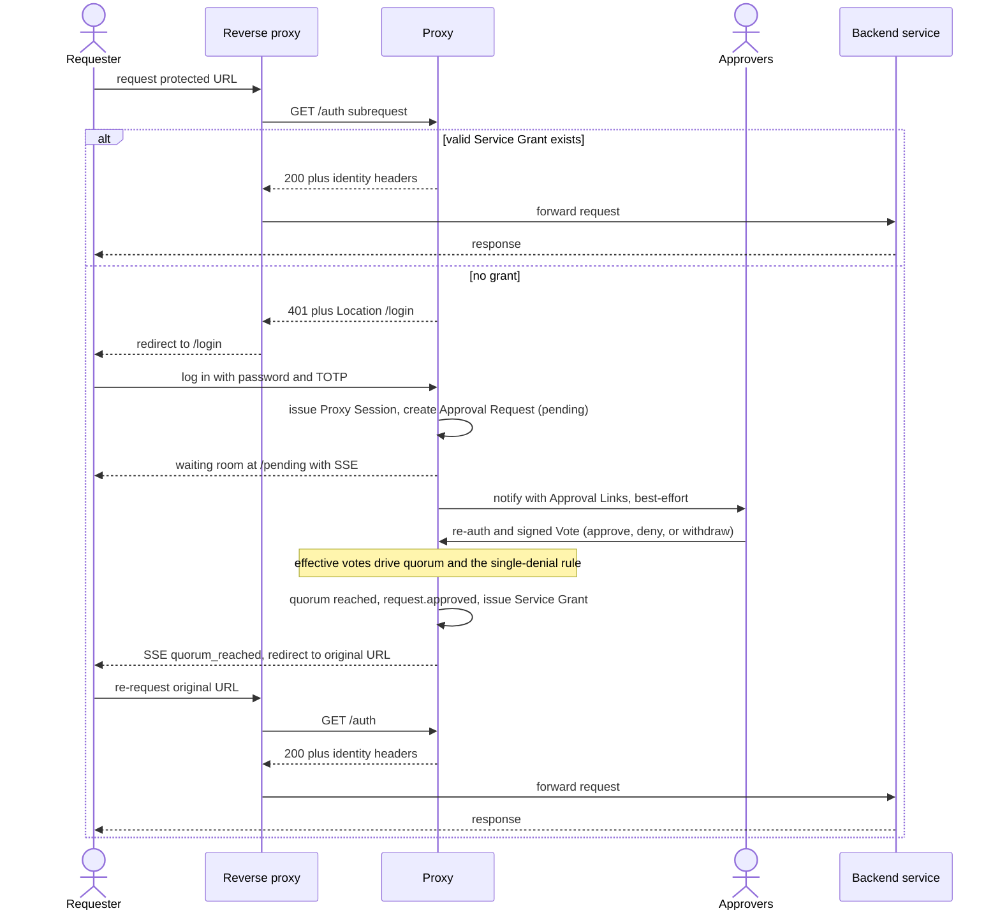

# Use Case: Shared Account Management

## Problem

When multiple people share ownership of an account (bank account, credit card, collaborative tools, shared passwords), one owner can unilaterally access or modify the account without the other owners' knowledge or consent.

**Real-world example:** Separated parents jointly own a savings account for their child's education fund. Without multi-approval:

- Parent A can withdraw the entire balance without Parent B's consent
- Parent A can change the account holder's email or recovery phone number, locking Parent B out
- If Parent A's credentials are stolen, the attacker can drain the account

**The core issue:** Access to a shared account is unilaterally controlled by one owner.

## Solution

Put the shared account's web interface behind the proxy using the **forward-auth** pattern. An owner who wants access must first obtain quorum approval from the other owners; only then does the proxy grant interactive access to the account interface. No single owner can reach the account alone.

## Actors & Workflow

This is a `forward-auth` service: the owner reaches the account through a browser, waits for quorum, and is then forwarded to the account interface with an active Service Grant.

1. **Owner** (Parent A) navigates to the protected account interface in a browser.
2. The **reverse proxy** intercepts the request and asks the proxy (`GET /auth`) whether to allow it.
3. With no valid Service Grant, the proxy redirects Parent A to log in (password + TOTP) and creates an Approval Request, then drops Parent A into a real-time waiting room.
4. The proxy notifies the other **owners** (Parent B) with an Approval Link.
5. **Owner B** clicks the link, re-authenticates (password + TOTP), reviews the request (who is asking, for which account), and casts a signed Vote — approve, deny, or withdraw.
6. Once **quorum is reached**, the proxy issues a **Service Grant** and forwards Parent A to the account interface, injecting identity headers. Parent A has interactive access for the lifetime of the grant.
7. The proxy records the request, the votes, and the grant in the audit trail.



## Threat Model

**Attack scenario A (unilateral action):** Parent A wants to act on the account without Parent B's knowledge. With multi-approval, Parent B must consent before access is granted.

**Attack scenario B (credential theft):** An attacker steals Parent A's proxy credentials. Even so, the attacker cannot reach the account without quorum — they still need Parent B's approval.

**Assumption:** Both owners are trustworthy and will not collude with an attacker. Either owner can block the other's requests by denying.

## Configuration (YAML)

```yaml
services:
  shared-account:
    approvers:
      - parent_a
      - parent_b
    quorum: 2  # both owners must approve
    type: forward-auth
    backend: http://shared-account-app:8080
```

**Note:** The quorum is configurable by the account owners. Different accounts may have different rules:

- Some might require unanimous approval (2-of-2)
- Some might add a third-party approver (a trusted family member, lawyer, accountant) for tie-breaking
- Larger owner groups might require a majority rather than unanimity

## Access Model

- **Access is mediated, not handed over.** After quorum, the proxy forwards the owner to the account interface with identity headers and a time-bounded Service Grant. The owner interacts with the account through that granted session.
- **Service Credential stays in the proxy.** If the backend needs a credential to authenticate the forwarded session, the proxy holds it as a Service Credential and never exposes it to the owner.
- **Grants are time-bounded.** A Service Grant gives access for its configured lifetime; once it expires, the next access is re-gated through a fresh Approval Request.

### Audit Trail

Every step is logged:

- Who requested access
- Who approved, denied, or withdrew (each Vote signed)
- Which account / service
- When the request, the grant, and the access occurred
- When the grant expired

## Security Properties

- **Quorum required:** No owner gets access without the configured number of approvals. No unilateral access.
- **Approval tied to identity:** Each Vote is tied to an owner's authentication (password + TOTP) and is signed, preventing unauthorized approval.
- **No standing unilateral access:** Access is bounded by the Service Grant's lifetime and re-gated when it expires.
- **Audit trail:** Every access and approval is logged and auditable.
- **Flexible threshold:** Owners configure the quorum rule (unanimous, majority, third-party tie-breaker, etc.).

## Usability Considerations

- **Friction:** One owner cannot act alone; access requires coordination with other owners. This is intentional but requires time and communication.
- **Slow operations:** Owners are distributed (different time zones, schedules); approvals may take time.
- **False negatives:** Legitimate access might be delayed if one owner is unavailable.

**Mitigations:**

- Show approval status in the waiting room (waiting for Parent B)
- Notification reminders ("request pending since 2 hours ago") *(future)*
- Emergency access if one owner is incapacitated *(future)*

## Real-World Applicability

This use case is implementable with the multi-approval system because:

1. **Simple workflow:** Request access → approve / deny → forwarded to the account. No complex domain-specific logic.
2. **Natural fit for forward-auth:** The shared account is reached through a web interface, exactly what the forward-auth pattern protects.
3. **Clear threat model:** Prevents unilateral access to shared resources.
4. **Configurable threshold:** Owners choose their own rules (unanimous, majority, etc.).

## Evaluation Questions

- **Usability:** How much friction is acceptable for account security? (benchmark: how long does Parent B typically take to approve?)
- **Emergency access:** If Parent B is unreachable, can Parent A obtain access in an emergency with an audit trail?
- **Access mediation:** Can the proxy safely mediate access to the account without exposing the underlying account to attackers?
- **Integration:** Which account interfaces can sit behind the proxy's forward-auth? (internal tools, SaaS apps that accept identity headers)

## Future Extensions

- **Time-based rules:** Access can proceed automatically if quorum is reached by a deadline; otherwise the request is denied.
- **Per-action thresholds:** Routine access needs fewer approvals; sensitive actions require more (depends on the backend being able to express the distinction).
- **Recovery keys:** If one owner loses access, a trusted recovery contact can approve actions for a limited time.
